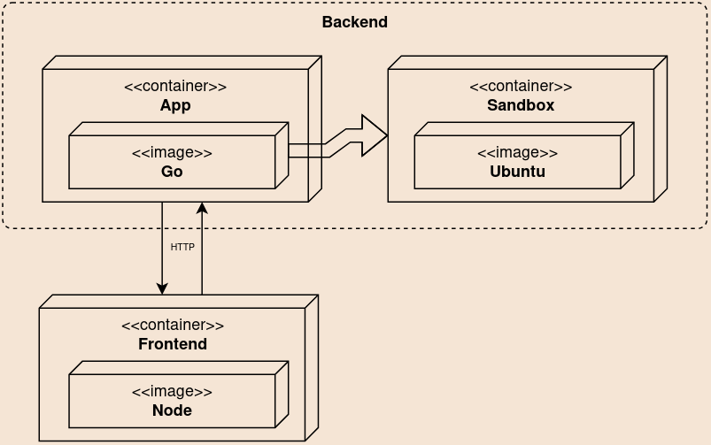
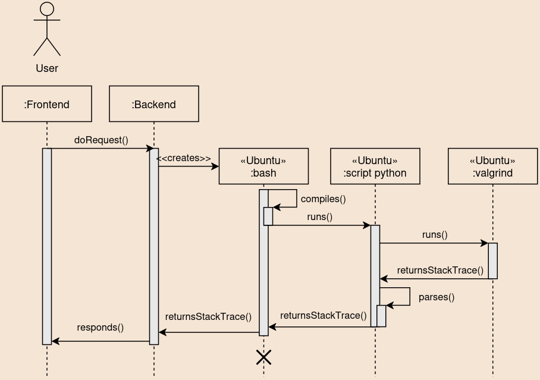

# How Pointers Work - Server

This server receives HTTP requests with C/C++ code and returns the **stackstrace** of the first 300 lines that are run. The stacktrace contains the state of each line, both in the stack and heap: names, types and addresses of variables, the current function name and signature, etc.


It was inspired by [this article](https://dev.to/acoh3n/lets-build-a-code-execution-engine-4kgi) on [Tork engine](https://github.com/runabol/tork) and this [fork of Philip Guo's Python Tutor](https://github.com/meghaagr13/CTutor).

This system also has a <a href="https://github.com/arturo32/HowPointersWork">frontend repository</a>.

## How it works

Theres is 2 kinds of containers in this backend server (actually 3, but let's no focus on that for now): one that holds the Go application that uses Tork and other that is the sandbox where the C/C++ code is compiled and run with Valgrind.



See the big arrow in the image above? That is Tork managing and creating a container as a task when it receives a request. 




## Running
This project is composed of two images: One that will run the Go program and other that will be run by Tork.

So we need to first build the image that Tork will use (the one that will compile and run the custom valgrind):
```bash
sudo docker build -f Dockerfile -t gcc-compiler .
```

Then, we build the main image:
```bash
sudo docker build -f Dockerfile.main -t hpw-server .
```

### With docker compose

```sh
apt install haveged # docker compose use of random things like.. name creation?
sudo docker compose up -d
```

To see **logs**, run:
```sh
sudo docker compose logs hpw-server
```

### Without docker compose

We build and run postgres:
```sh
sudo docker run -d --name tork-postgres -p 5432:5432 -e POSTGRES_PASSWORD=tork -e POSTGRES_USER=tork  -e PGDATA=/var/lib/postgresql/data/pgdata   -e POSTGRES_DB=tork postgres:15.3
```

As ["Docker in docker" is unadvised](https://jpetazzo.github.io/2015/09/03/do-not-use-docker-in-docker-for-ci/), we run the main container using the `-v` flag that will bind the most internal container image docker socket to the external docker. Ps.: `--network=host/--net=host` don't work on Windows.

```bash
sudo docker run -v /var/run/docker.sock:/var/run/docker.sock --network=host -d hpw-server
```


Execute a code snippet. Example

```bash
curl \
  -s \
  -X POST \
  -H "content-type:application/json" \
  -d '{"language":"c","code":"#include <stdio.h>\n\nint main(){\nint i = 23;\nint *k = &i;\nreturn 0;\n}"}' \
  http://localhost:8000/execute
```

You can try changing the `language` to `c++`.


### How to update Tork in the future
```bash
go list -m -u github.com/runabol/tork #find last version
go get github.com/runabol/tork@v0.1.121 #get last version
go mod tidy #syncronize dependencies
```
